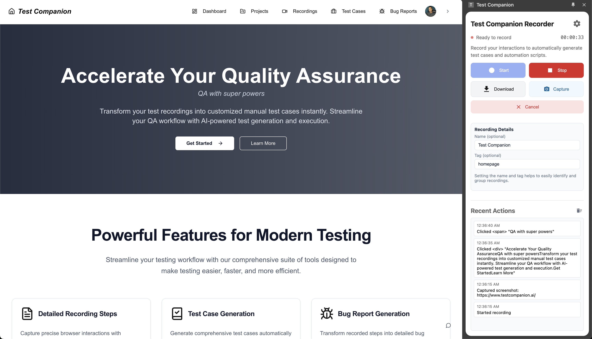

## Welcome to Test Companion

Test Companion is an end-to-end testing solution that helps you record, analyze, and generate test cases and bug reports for your web applications. This documentation will guide you through all features and help you make the most of our platform.

## Getting Started

Get up and running with Test Companion in minutes.

<CardGroup cols={2}>
  <Card title="Quick Start Guide" icon="rocket" href="/quickstart">
    Install the extension and record your first test
  </Card>

  <Card title="Core Concepts" icon="book" href="/concepts">
    Learn the fundamental concepts of Test Companion
  </Card>
</CardGroup>

## Key Components

Understand the main features of Test Companion.

<CardGroup cols={2}>
  <Card title="Recording & Playback" icon="video" href="/features/recording">
    Learn how to capture your web interactions with the browser extension
  </Card>

{" "}
<Card title="Test Case Generation" icon="flask" href="/features/test-cases">
  Convert recorded steps into structured test cases
</Card>

{" "}
<Card title="Bug Reporting" icon="bug" href="/features/bug-reporting">
  Create comprehensive bug reports with AI assistance
</Card>

  <Card title="Requirements Management" icon="list-check" href="/features/requirements">
    Track and manage testing requirements
  </Card>
</CardGroup>

## Developer Resources

Access technical resources and integration guides.

<CardGroup cols={2}>
  <Card title="API Reference" icon="code" href="/api-reference">
    Explore our API documentation
  </Card>

{" "}
<Card title="Integration Guide" icon="puzzle-piece" href="/integration">
  Learn how to integrate Test Companion into your workflow
</Card>

{" "}
<Card title="Best Practices" icon="star" href="/best-practices">
  Follow recommended testing patterns
</Card>

  <Card title="Troubleshooting" icon="wrench" href="/troubleshooting">
    Find solutions to common issues
  </Card>
</CardGroup>
