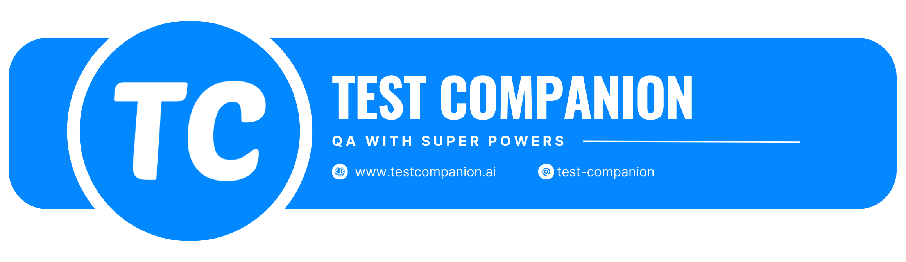

## What is Test Companion?

Test Companion is an end-to-end testing solution that helps you record, analyze, and generate test cases and bug reports for your web applications. This documentation will guide you through all features and help you make the most of our platform.

## How does it work?

Streamline your testing workflow in four simple steps:

<Steps>
  <Step title="Record">
    Record your web interactions with the browser extension.
  </Step>
  <Step title="Generate">
    Generate detailed structured test cases and bug reports.
  </Step>
  <Step title="Refine">Refine your test cases with AI assistance.</Step>
  <Step title="Export">
    Export your test cases to your preferred test management platform.
  </Step>
</Steps>

<Note>
  Test Companion integrates seamlessly with popular testing platforms like
  QualityWatcher, ensuring your testing workflow remains uninterrupted.
</Note>

## Getting Started

Get up and running with Test Companion in minutes.

<CardGroup cols={2}>
  <Card title="Quick Start Guide" icon="rocket" href="/quickstart">
    Install the browser extension and record your first test
  </Card>

  <Card title="Core Concepts" icon="book" href="/concepts">
    Understand the fundamental concepts of Test Companion
  </Card>
</CardGroup>

## Key Components

Understand the main features of Test Companion.

<CardGroup cols={2}>
  <Card title="Record web interactions" icon="video" href="/features/recording">
    Learn how to capture your web interactions with the browser extension
  </Card>

{" "}

<Card title="Test Case Generation" icon="flask" href="essentials/test-cases">
  Convert recorded steps into detailed & structured test cases
</Card>

{" "}

<Card title="Bug Reporting" icon="bug" href="essentials/bug-reports">
  Create comprehensive bug reports with AI assistance
</Card>

  <Card title="Requirements Management" icon="list-check" href="essentials/requirements">
    Track and manage testing requirements
  </Card>
</CardGroup>
